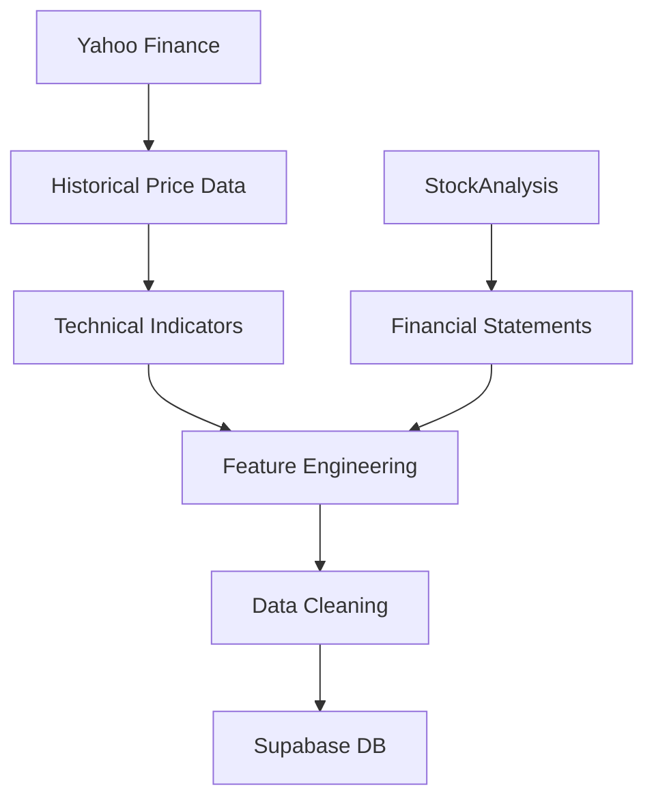

# LQ45 Stock Data Pipeline

End-to-end data pipeline for collecting, processing, and storing Indonesian LQ45 stock market data.
This project automates the process of retrieving historical price data, generating technical indicators, scraping financial statements, and storing the results in a cloud database.

The pipeline is designed to be reproducible, idempotent, and scalable, making it suitable for quantitative research, financial analytics, and machine learning applications.

# Project Overview
Financial analysis and quantitative modeling require reliable and structured datasets. However, Indonesian stock data is often fragmented across multiple sources.
This project builds a data engineering pipeline that integrates market and financial data into a single structured dataset.
The pipeline performs the following tasks:
1. Collect historical stock price data
2. Compute technical indicators
3. Scrape quarterly financial statements
4. Perform financial feature engineering
5. Store processed data in Supabase

The resulting dataset can be used for:
- Stock price prediction
- Quantitative trading strategies
- Financial analysis
- Machine learning models

# Pipeline Architecture
The data pipeline integrates multiple sources into a centralized storage system.


# Technical Indicators
- SMA 5
- SMA 20
- RSI (14)
- Bollinger Bands
- ATR (14)
- OBV (On Balance Volume)
- Daily return
- 3-day return
- 5-day return
These indicators are commonly used in algorithmic trading and stock forecasting models.

# Financial Data Scraping
Quarterly financial statements are scraped from StockAnalysis.

Collected financial metrics include:
- Revenue
- Net Income
- Total Assets
- Total Liabilities
- Short-Term Debt
- Long-Term Debt

# Financial Feature Engineering
From the raw financial data, several derived metrics are calculated:
- Revenue Growth (QoQ)
- Revenue Growth (YoY)
- Net Income Growth (QoQ)
- Net Income Growth (YoY)
- Return on Assets (ROA)
If a company reports financials in USD, the values are converted to IDR using historical USD/IDR exchange rates.

# Database Storage
Processed data is stored in Supabase.

Two main datasets are stored:
- Technical Dataset: `ticker_technical`
- Fundamental Dataset: `ticker_fundamental`

The pipeline uses batch upsert, ensuring:
- No duplicate records
- Safe re-execution of the pipeline
- Efficient database writes

# Tech Stack
- Python
- Pandas
- NumPy
- yfinance
- requests
- BeautifulSoup
- Supabase

# Potential Applications
The dataset generated by this pipeline can be used for:

- Time series forecasting
- Quantitative trading strategies
- Financial machine learning models

# Running the Data Pipeline
1. Add the Ticker Configuration File
   Place the 'tickers.json' file in the same directory as the notebook.
2. Configure Supabase Credentials
   Open your project in Supabase and obtain the Supabase URL and Supabase API Key.
   Insert these values into the variables provided in the notebook:
   ```
   SUPABASE_URL = "your_supabase_url"
   SUPABASE_KEY = "your_supabase_key"
4. Create Database Tables
   Run the SQL queries provided in this repository using the SQL Editor in Supabase.
5. Run the Pipeline Notebook on Google Colab or Jupyter Notebook

# Author
Yan Andhinaya Ardika
